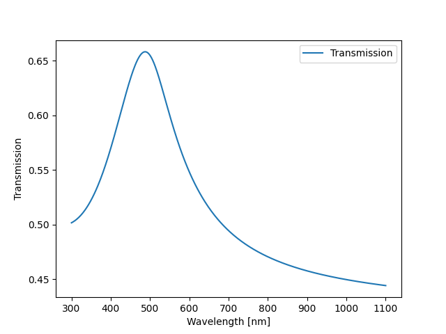

.. _ref_installation:

Installation and getting started
================================

Installation
-------------

You can install PyLumerical using pip.

First, ensure that you have the latest pip version:

.. code:: bash

    python -m pip install -U pip

Then, install using:

.. code:: bash

    python -m pip install ansys-lumerical-core

Requirements
-------------

You must have an Ansys Lumerical GUI license to use PyLumerical. For more information, please visit the `licensing page <https://optics.ansys.com/hc/en-us/articles/360033862333-Lumerical-product-components-and-licensing-overview>`_ on the Ansys Optics website.
In addition, you must also have Lumerical |supported_lum_release| or later installed on your computer. Upon importing PyLumerical, the :doc:`autodiscovery </api/ansys/lumerical/core/autodiscovery.rst>` function automatically locates the Lumerical installation path. If it fails to do so, you must set the path manually using :func:`ansys.lumerical.core.autodiscovery.locate_lumerical_install`.

.. Turn off vale here due to captizalization issues being wrongly flagged by vale.

.. vale off

My first PyLumerical project
-----------------------------

.. vale on

The code snippet below provides simple project of using PyLumerical to visualize the transmission of a gold thin film illuminated by a plane wave.

.. code-block:: python

   import ansys.lumerical.core as lumapi # Ensure lumapi has already been added to path
   import numpy as np
   import matplotlib.pyplot as plt

   with lumapi.FDTD() as fdtd:
      lambda_range = np.linspace(300e-9, 1100e-9, 500)
      c=2.99792458e8
      f_range = c/lambda_range
      au_index = fdtd.getfdtdindex("Au (Gold) - CRC", f_range, np.min(f_range), np.max(f_range)) # Use the getfdtdindex command to obtain the correct complex index for gold

      stackRT_result = fdtd.stackrt(np.transpose(au_index), np.array([10e-9]), f_range) # Use the stackrt command to calculate the transmission and reflection
   # Visualize using matplotlib
   fig, ax = plt.subplots()
   ax.plot(lambda_range*1e9, stackRT_result["Ts"], label="Transmission")
   ax.set_xlabel("Wavelength [nm]")
   ax.set_ylabel("Transmission")
   ax.legend()
   plt.show()

This simulation returns the following result.

Further resources
-----------------

.. grid:: 2 2 3 3

    .. grid-item-card:: User guide
      :link: ../user_guide/index
      :link-type: doc

      Information on key concepts of PyLumerical.

    .. grid-item-card:: API reference
      :link: ../api/index
      :link-type: doc

      Reference for the PyLumerical API.

    .. grid-item-card:: Examples
        :link: ../examples
        :link-type: doc

        Gallery of examples using PyLumerical.

..
    TODO: Revamp application examples below. Give a few recommended ones. Add link to example landing page above.

Recommended examples
----------------------

Recommended examples to further build your understanding of PyLumerical and its capabilities.

Ansys Lumerical FDTD™
^^^^^^^^^^^^^^^^^^^^^^

- `Nanowire example using FDTD`_

.. _Nanowire example using FDTD: https://optics.ansys.com/hc/en-us/articles/360034416574-FDTD-application-example

Ansys Lumerical INTERCONNECT™
^^^^^^^^^^^^^^^^^^^^^^^^^^^^^

- `Monte Carlo analysis in INTERCONNECT`_
- `Optical transceiver co-simulation in INTERCONNECT`_

.. _Optical transceiver co-simulation in INTERCONNECT: https://optics.ansys.com/hc/en-us/articles/360034936773-Python-co-simulation-with-INTERCONNECT
.. _Monte Carlo analysis in INTERCONNECT: https://optics.ansys.com/hc/en-us/articles/360034416574-INTERCONNECT-application-example

