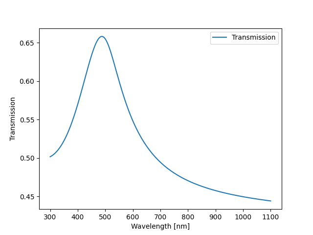

.. _ref_installation:

Installation and getting started
================================

Installation
-------------
|python|

.. |python| image:: https://img.shields.io/pypi/pyversions/ansys-lumerical-core?logo=pypi
   :target: https://pypi.org/project/ansys-lumerical-core/
   :alt: Python

You can install PyLumerical using pip.

First, create a virtual environment and activate it to avoid dependency conflicts and to keep your global Python environment clean.

.. tab-set::

   .. tab-item:: Linux

      .. code-block:: bash

         python -m venv .venv
         source .venv/bin/activate

   .. tab-item:: Windows Command Prompt

      .. code-block:: bash

         python -m venv .venv
         .venv\\Scripts\\activate.bat

   .. tab-item:: Windows Powershell

      .. code-block:: bash

         python -m venv .venv
         .venv\\Scripts\\Activate.ps1

Then, upgrade pip to the latest version, and install PyLumerical with the package name `ansys-lumerical-core`.

.. code:: bash

    python -m pip install -U pip
    python -m pip install ansys-lumerical-core

.. tip::
    Using a virtual environment isn't a requirement, but it's a best practice for Python development.
    PyLumerical is compatible with various Python IDEs including VS Code, Jupyter Notebook, and Cursor. After installation, you can use your preferred editor to start using PyLumerical.

Requirements
-------------

You must have an Ansys Lumerical GUI license along with Lumerical |supported_lum_release| or later on your computer to use PyLumerical. For more information, please visit the `licensing page <https://optics.ansys.com/hc/en-us/articles/360033862333-Lumerical-product-components-and-licensing-overview>`_ on the Ansys Optics website.

Upon importing PyLumerical, the :doc:`autodiscovery <../api/autodiscovery>` logic automatically locates the Lumerical installation path and configures interop.
If autodiscovery fails, set the ``LUMERICAL_HOME`` environment variable before import and start a new Python session.

To use the Lumerical photonic inverse design module lumopt2, you must have Ansys Lumerical FDTD™ version 2026 R1.2 or later installed on your computer. The autodiscovery logic automatically locates the lumopt2 module if it is available.

Importing modules
------------------

To use PyLumerical for simulation automation:

.. code-block:: python

   import ansys.lumerical.core as lumapi

.. tip::

   When imported this way, you can directly use your scripts written with the legacy lumapi Python module.

To use the lumopt2 inverse design module:

.. code-block:: python

   import ansys.lumerical.core.lumopt2 as lmpt

.. warning::
   Manual ``sys.path`` overrides for ``lumopt2`` are unsupported.

.. tip::
   For consistent module binding, import ``ansys.lumerical.core`` before importing ``lumapi`` or ``lumopt2`` directly.

.. Turn off vale here due to captizalization issues being wrongly flagged by vale.

.. vale off

My first PyLumerical project
-----------------------------

.. vale on

The code snippet below provides a simple project of using PyLumerical and the Python library matplotlib to visualize the transmission of a gold thin film illuminated by a plane wave.

.. code-block:: python

   import ansys.lumerical.core as lumapi
   import numpy as np
   import matplotlib.pyplot as plt # Ensure matplotlib is installed in your environment first

   with lumapi.FDTD() as fdtd:
      lambda_range = np.linspace(300e-9, 1100e-9, 500)
      c=2.99792458e8
      f_range = c/lambda_range
      au_index = fdtd.getfdtdindex("Au (Gold) - CRC", f_range, np.min(f_range), np.max(f_range)) # Use the getfdtdindex command to obtain the correct complex index for gold

      stackRT_result = fdtd.stackrt(np.transpose(au_index), np.array([10e-9]), f_range) # Use the stackrt command to calculate the transmission and reflection
   # Visualize using matplotlib
   fig, ax = plt.subplots()
   ax.plot(lambda_range*1e9, stackRT_result["Ts"], label="Transmission")
   ax.set_xlabel("Wavelength [nm]")
   ax.set_ylabel("Transmission")
   ax.legend()
   plt.show()

This simulation returns the following result.

Further resources
-----------------

.. grid:: 2 2 3 3

    .. grid-item-card:: User guide
      :link: ../user_guide/index
      :link-type: doc

      Information on key concepts of PyLumerical.

    .. grid-item-card:: API reference
      :link: ../api/index
      :link-type: doc

      Reference for the PyLumerical API.

    .. grid-item-card:: Examples
      :link: ../examples
      :link-type: doc

      Gallery of examples using PyLumerical.

.. grid:: 1 1 1 1

   .. grid-item-card:: Photonic inverse design with lumopt2
      :link: ../user_guide/photonic_inverse_design_with_lumopt2
      :link-type: doc

      Information on using lumopt2 for photonic inverse design.

Recommended examples
----------------------

Recommended examples to further build your understanding of PyLumerical and its capabilities.

.. grid:: 2 2 3 3

   .. grid-item-card:: Basic FDTD simulation
      :link: ../examples/Sessions_and_Objects/fdtd_example1_pythonic
      :link-type: doc

      Run an FDTD simulation using PyLumerical and plot the electric field.

   .. grid-item-card:: Basic MODE simulation
      :link: ../examples/Single_Solver_Workflows/waveguide_FDE
      :link-type: doc

      Run a waveguide simulation in MODE.

   .. grid-item-card:: Basic INTERCONNECT simulation
      :link: ../examples/Single_Solver_Workflows/ring_resonator_interconnect
      :link-type: doc

      Run an an INTERCONNECT simulation for a ring resonator.
