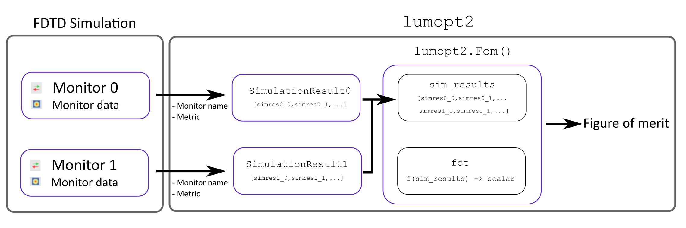

Figure of merit
===============

The figure of merit is the device performance metric being optimized. It can incorporate multiple competing objectives by combining them in a user-defined function based on results from the FDTD simulations.

In ``lumopt2``, the basis of the figure of merit comes from various monitors in the simulation. The monitor results in the simulation are extracted into ``lumopt2`` as ``SimulationResult`` objects, which requires the monitor input and a metric.
These ``SimulationResult`` objects are then combined into a figure of merit using the :py:func:`~lumopt2.fom.fom.Fom` function, which takes in the results and applies a function to output a real-valued scalar value. Finally, the :py:class:`~lumopt2.core.project.Project` class takes in the figure of merit as a part of its inputs.

The diagram below illustrates how monitor results are transformed into the figure of merit in ``lumopt2``.

Simulation results
------------------

The lumopt2 module supports the following types of monitors, relating to different type of simulation results metrics.

.. list-table::
   :header-rows: 1

   * - Monitor
     - Simulation Result
     - Metric
     - Metric Definition
   * - `Field region <https://optics.ansys.com/hc/en-us/articles/36967414684947-Field-Region-Simulation-object>`__
     - :py:class:`~lumopt2.fom.simulation_results.FieldResults`
     - intensity
     - Sum of :math:`|E|^2` over spatial coordinates.
   * - `FDTD port object <https://optics.ansys.com/hc/en-us/articles/360034382554-Ports-FDTD-Simulation-Object>`__
     - :py:class:`~lumopt2.fom.simulation_results.PortResults`
     - transmission
     - Transmission accounting for mode overlap, same as the ``T_out`` value in the `FDTD port object <https://optics.ansys.com/hc/en-us/articles/360034382554-Ports-FDTD-Simulation-Object>`__.

The :py:class:`~lumopt2.fom.simulation_results.FieldResults` class extracts field intensity from a field region monitor.

To define a field result object, you need to specify the name of the field region object, the metric to extract, and the wavelength to evaluate the results at.

.. code:: python

   # Create a field result object for a wavelength of 940 nm

   intensity = lmpt.FieldResults(monitor_name='field_result', metric='intensity', wavelengths = 940e-9)

.. warning::

   The field region object only accepts a single wavelength. However, you can create a multi-wavelength figure of merit via multiple simulation configurations.

The :py:class:`~lumopt2.fom.simulation_results.PortResults` class extracts transmission  from a `FDTD port object <https://optics.ansys.com/hc/en-us/articles/360034382554-Ports-FDTD-Simulation-Object>`__.
This class is typically used for photonic integrated circuit applications.

To define a port result object, you need to specify the name of the port, the metric to evaluate, as well as the wavelengths to extract the result for.
You can also define a port result object for multiple wavelengths, using a list or numpy array.

.. code:: python

   # Create a port result object for a wavelength between 1200nm and 1400nm (O-Band)

   wavelengths = np.linspace(1200e-9, 1400e-9, 21)
   port_results = lmpt.PortResults('port_out', metric='transmission', wavelengths=wavelengths)

Defining a figure of merit
--------------------------

After you define simulation results relevant for the optimization, use :py:func:`~lumopt2.fom.fom.Fom` to combine them to form a function that will be optimized.

This function takes in simulation result objects of the same type, and applies either a pre-defined or a custom function to formulate the figure of merit, outputting a scalar value.

Default functions
~~~~~~~~~~~~~~~~~

If you don't define your own function for the figure of merit, the default function is to use the intensity directly for field results, and the P-norm for port results.

In general, the P-norm function uses the following formula

:math:`FOM=\text{mean}(w\cdot|target|^p)-(\text{mean}(w\cdot|T(\lambda)-target|^p))^{1/p}`

where :math:`T` is a wavelength-dependent transmission, :math:`w` is a wavelength-dependent weight, :math:`target` is the target value for the metric, and :math:`p` is the order of the P-norm.

The default function without any specifications uses equal weights across wavelengths, a target value of 1, and an order of 1, reducing to :math:`1-\text{mean}(|T(\lambda)-1|)`.

You can also provide multiple simulation results as a list to the function. In this case, the default function takes the mean of all field results, or the P-norm of the port results concatenated.

.. code:: python

   # Define a figure of merit based on a simulation result, using the default function
   # The simulation results are previous defined using PortResult or FieldResults class

   fom = lmpt.Fom(my_simulation_results)

Custom functions
~~~~~~~~~~~~~~~~

To define a custom function for the figure of merit, you can pass a callable to the ``fct`` field of the :py:func:`~lumopt2.fom.fom.Fom` function.

This function must take in all simulation results you wish to use as a concatenated autograd array, and outputs a single real-valued scalar value as the figure of merit output.
If your result is a vector, for example, if you are examining a metric over multiple wavelengths, you must first transform it into a scalar value.

During optimization, the gradient of the custom figure of merit function is computed via automatic differentiation. Therefore, ensure that operations in your function are compatible with autograd.
For a list of compatible operations, see the "supported and unsupported parts" section in the `autograd documentation <https://github.com/HIPS/autograd/blob/master/docs/tutorial.md>`__.

The example below illustrates how to define a custom figure of merit function for a focus region with multiple field region monitors.

.. code:: python

   intensity_focus = lmpt.FieldResults(monitor_name='focus', metric='intensity', wavelengths = 940e-9)
   intensity_norm = lmpt.FieldResults(monitor_name='norm', metric='intensity', wavelengths = 940e-9)
   def custom_fct(result_list):
      return result_list[0]/result_list[1]

   fom = lmpt.Fom([intensity_focus, intensity_norm], fct = custom_fct)

The example below illustrates a weighted sum custom figure of merit for multiple port results for different channels.

.. code:: python

   trans_ch1 = lmpt.PortResults('port_out1', metric='transmission', wavelengths=wdm_wavelengths[0], tolerance=5e-9)
   trans_ch2 = lmpt.PortResults('port_out2', metric='transmission', wavelengths=wdm_wavelengths[1], tolerance=5e-9)
   trans_ch3 = lmpt.PortResults('port_out3', metric='transmission', wavelengths=wdm_wavelengths[2], tolerance=5e-9)
   trans_ch4 = lmpt.PortResults('port_out4', metric='transmission', wavelengths=wdm_wavelengths[3], tolerance=5e-9)

   def custom_fct(x):
      p = 2
      pnorm_func = lmpt.PNorm(target=1, p=p)
      fom1 = pnorm_func(x[0])
      fom2 = pnorm_func(x[1])
      fom3 = pnorm_func(x[2])
      fom4 = pnorm_func(x[3])
      return 0.1*fom1 + 0.1*fom2 + 0.3*fom3 + 0.3*fom4

   fom = lmpt.Fom([trans_ch1, trans_ch2, trans_ch3, trans_ch4], fct=custom_fct)

.. _multi-sim-config:

Multiple simulation configuration
---------------------------------

In some cases, it is important to formulate the overall figure of merit based on variations of the same base simulation, for example, multiple polarization or sources.

In this case, lumopt2 provides the option to define multiple simulation configurations via the :py:class:`~lumopt2.core.project_config.ProjectConfig` class and the ``config`` argument in simulation results.
During the optimization, each simulation configuration is ran, and you can combine the result from the different configurations into a single figure of merit using the same approach as discussed above.

To create a new project configuration, initialize the :py:class:`~lumopt2.core.project_config.ProjectConfig` with a configurator.
The configurator is a a callable function or a path to a Lumerical script file that modifies the base simulation.

.. vale off

Example - S-and P polarization sources
~~~~~~~~~~~~~~~~~~~~~~~~~~~~~~~~~~~~~~

.. vale on

This example demonstrates using multiple configurations for S- and P-polarized sources.

First, you can define the base simulation in ``base_simulation.lsf`` and set up the monitors.

.. code::

   #Setup code

   ...

   addgaussian;
   set("name", "source");

   ...

   addfieldregion;
   set("name","fom");

Then, you can define a configuration script that adds an S-polarized source in ``s1_config.lsf``.

.. code::

   setnamed("source","polarization definition", "S");
   ...

You can then create a separate script that adds a P-polarized source in ``s2_config.lsf``.

.. code::

   setnamed("source","polarization definition", "P");
   ...

Two separate ProjectConfig objects are configured with the scripts above and passed to the simulation result objects. The simulation results are can now be used in the :py:func:`~lumopt2.core.fom.Fom` function.

.. code:: python

   config_S = lmpt.ProjectConfig(configurator='path/to/s1_config.lsf', filename_suffix='S')
   config_P = lmpt.ProjectConfig(configurator='path/to/s2_config.lsf', filename_suffix='P')
   int_S   = lmpt.FieldResults('fom',   metric='intensity', wavelengths=1550e-9, config=config_S)
   int_P   = lmpt.FieldResults('fom',   metric='intensity', wavelengths=1550e-9, config=config_P)

   def custom_fct(x):
      return (x[0] + x[1]) / 2

   fom = lmpt.Fom([int_S, int_P], fct=custom_fct)

The base setup script is still used when defining the project, but the configuration scripts are automatically applied for the optimization problem when it is run.

.. code:: python

   # Configurator scripts included in fom

   project = lmpt.Project(setup = "base_simulation.lsf",
                       fdtd_session = fdtd_session,
                       parametrization = parametrization,
                       fom = fom)

Example - multi-wavelength for field region
~~~~~~~~~~~~~~~~~~~~~~~~~~~~~~~~~~~~~~~~~~~

This example demonstrates how to use multiple configuration files to define a multi-wavelength figure of merit for field region monitors, which can be useful for color router applications.

First, set up the base simulation in ``base_simulation.lsf`` and set up the monitors.

.. code::

   #Setup code

   ...

   addgaussian; # Add the source object

   ...

   setglobalsource('wavelength span', 0); # Define source settings that will persist for all configurations
   setglobalsource("optimize for short pulse",false);

   ...

   addfieldregion;
   set('name','fom_red');

   ...

   addfieldregion;
   set('name','fom_blue');

Then, you can define a configuration script that modifies the wavelength of the source for red and blue wavelengths with ``red_config.lsf`` and ``blue_config.lsf``.

.. code::

   # red_config.lsf

   wl_red = 650e-9;
   setglobalsource('center wavelength',wl_red);

.. code::

   # blue_config.lsf

   wl_blue = 450e-9;
   setglobalsource('center wavelength',wl_blue);

Two separate ProjectConfig objects are configured with the scripts above and passed to the simulation result objects. The simulation results are can now be used in the :py:func:`~lumopt2.core.fom.Fom` function.

.. code:: python

   config_red = lmpt.ProjectConfig(configurator=configfile_red, filename_suffix='red')
   config_blue = lmpt.ProjectConfig(configurator=configfile_blue, filename_suffix='blue')

   int_red   = lmpt.FieldResults('fom_red',   metric='intensity', wavelengths=650e-9, config=config_red)
   int_blue   = lmpt.FieldResults('fom_blue',   metric='intensity', wavelengths=450e-9, config=config_blue)

   def custom_fct(x):
      return (x[0] + x[1]) / 2

   fom = lmpt.Fom([int_red, int_blue], fct=custom_fct)

Then, set up the project as normal.

.. code:: python

   # Configurator scripts included in fom

   project = lmpt.Project(setup = "base_simulation.lsf",
                       fdtd_session = fdtd_session,
                       parametrization = parametrization,
                       fom = fom)

.. vale off