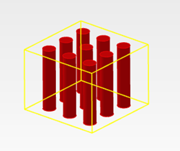
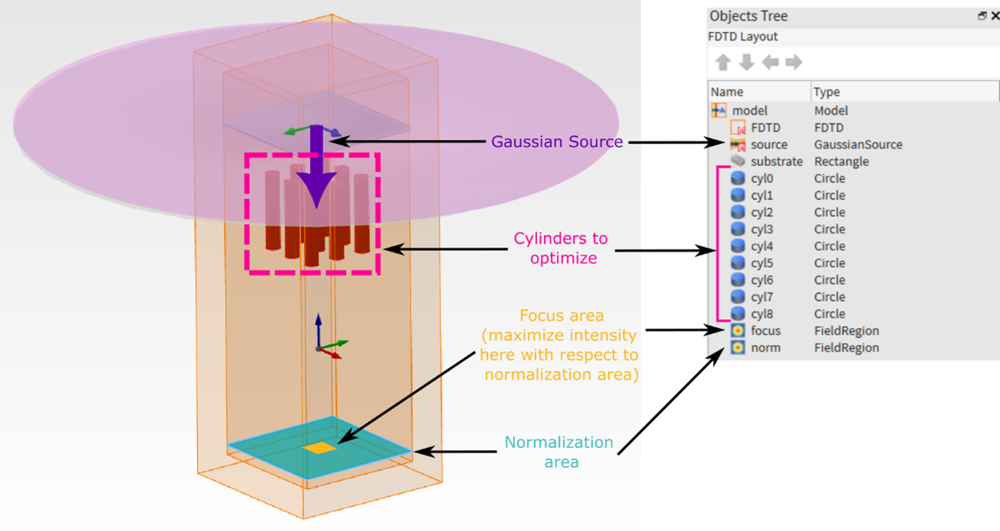
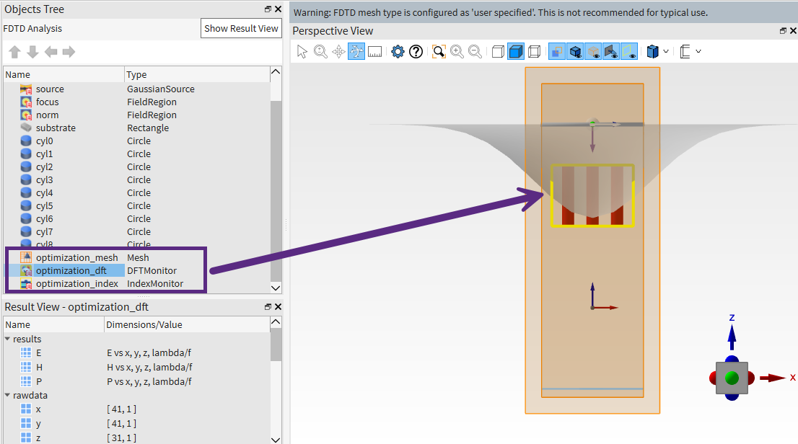
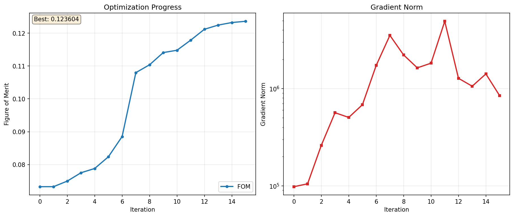

.. grid:: 1 2 2 2

    .. grid-item::

        .. button-link:: ../../_static/simulation_examples/lumopt2_3x3pillar/metalens_3x3.py
            :color: secondary
            :shadow:
            :align: center

            :octicon:`download` Download Python Script (.py)

    .. grid-item::

        .. button-link:: ../../_static/simulation_examples/lumopt2_3x3pillar/metalens_3x3.fsp
            :color: secondary
            :shadow:
            :align: center

            :octicon:`download` Download Simulation File (.fsp)

Getting started with lumopt2: 3x3 array of pillars
==================================================

This article discusses the usage of the lumopt2 inverse design module in Lumerical FDTD for a basic parametric optimization.

Using a basic 3x3 array of pillars, this example highlights key functionalities of the lumopt2 module and walks you through the steps necessary to create and run a simple optimization.
The simulation file and script associated with this example can be downloaded using the download buttons above.

Prior to working through the example, please ensure that lumopt2 is successfully set up and importable as seen from the :doc:`getting started <../photonic_inverse_design_with_lumopt2>` page.

Base simulation file
--------------------
The base simulation file consists of an array of 9 silicon cylinders, arranged in a 3x3 array, embedded in an SiO2 substrate. Each cylinder has a fixed length, but the radius can vary within set bounds for optimization. This structure mimics a simple metalens arrangements with cylindrical meta-atoms.

The optimization goal is to maximize the field intensity in the center region under a gaussian source excitation, normalized to the intensity of the entire area where the incoming ray would hit. This mimics the intention of focusing the ray on a given region.

The attached Lumerical FDTD project (.fsp) file contains the already set up base simulation, with a `simulation region <https://optics.ansys.com/hc/en-us/articles/360034382534-FDTD-solver-Simulation-Object>`__, `gaussian source <https://optics.ansys.com/hc/en-us/articles/360034382854-Plane-wave-and-beam-source-Simulation-object>`__, `cylinder geometries <https://optics.ansys.com/hc/en-us/articles/360034901513-Circle-Simulation-Object>`__, as well as `field region objects <https://optics.ansys.com/hc/en-us/articles/36967414684947-Field-Region-Simulation-object>`__ that are used in the figure of merit.

This example omits the details in setting up the base simulation file, but you can do this by using the `FDTD GUI interface <https://optics.ansys.com/hc/en-us/articles/360033154434-FDTD-product-reference-manual>`__, via the `Lumerical Scripting Language <https://optics.ansys.com/hc/en-us/articles/360037228834-Lumerical-scripting-language-By-category>`__, via :doc:`PyLumerical <../index>`, or a combination thereof. You can pre-configure your simulation as done in this example or choose to set up the simulation along side your lumopt2 optimization script.

.. tip::
    For lumopt2 optimizations, specific objects, such as `field region <https://optics.ansys.com/hc/en-us/articles/36967414684947-Field-Region-Simulation-object>`__ or `ports <https://optics.ansys.com/hc/en-us/articles/360034382554-Ports-FDTD-Simulation-Object>`__ are required for setting up the figure-of-merit.

Importing libraries
-------------------

To start using lumopt2, use the following import statement.

.. code-block:: python
    :lineno-start: 5

    import ansys.lumerical.core.lumopt2 as lmpt

The lumopt2 module exposes various important classes and functions directly from the top level namespace. For a full list of available functions, and for module level descriptions, refer to the :doc:`API reference <../../api/lumopt2/index>`.

Optimization region setup
------------------------------

Define the optimization region using the :py:class:`~lumopt2.utils.common.Box` class.

.. code-block:: python
    :lineno-start: 12

    optimization_region = lmpt.Box(x_span = 1e-6, y_span = 1e-6, z_min = 1e-6, z_max = 1e-6 + 750e-9,
                               dx = 0.025e-6, dy = 0.025e-6, dz = 0.025e-6)

This defines a box with 1 micron side length in the x and y-diirections, and a height of 750 nm in the z-direction, covering the area where the pillar geometry is expected to change.

.. note::

    Ensure that your optimization region fully contains all possible changes to the geometry during optimization.

Parametrization setup
----------------------

Link each cylinder radius to the optimization using the :py:class:`~lumopt2.parametrization.parametrization.Parametrization`, which maps arbitrary pre-existing Lumerical object properties to parameters in the optimization problem.
This class is the most general way to parametrize a design in lumopt2, and does not rely on geometry-specific operations like :py:class:`~lumopt2.parametrization.closed_curve.ClosedCurve`.

.. code-block:: python
    :lineno-start: 16

    num_cyl = 3*3
    bounds = [(0.05e-6, 0.1e-6)]*num_cyl
    def param_func(params):
        return OrderedDict({f'cyl{idx}::radius': value for idx, value in enumerate(params)})
    parametrization = lmpt.Parametrization(func=param_func, bounds=bounds, optimization_region=optimization_region)

Define the bounds for each cylinder.

.. code-block:: python
    :lineno-start: 17

    bounds = [(0.05e-6, 0.1e-6)]*num_cyl

The bounds variable defines the lower and upper bound for each pillar individually. For each pillar, a tuple of ``(lower_bound, upper_bound)`` is provided, and the list repeats for the total number of pillars.

The :py:class:`~lumopt2.parametrization.parametrization.Parametrization` class takes in a function, ``param_func`` that maps between Lumerical object properties to optimization parameters.
The function needs to map a parameter vector to a dictionary, such that the keys correspond to the object properties in the Lumerical simulation, and the values correspond an element in the parameter array.
The mapping function is as follows.

.. code-block:: python
    :lineno-start: 18

    def param_func(params):
        return OrderedDict({f'cyl{idx}::radius': value for idx, value in enumerate(params)})

For this problem, the function generates an ordered dictionary by enumerating through the input parameter vector.
The keys are in the format of ``cyl{idx}::radius``, where the field prior to ``::``, such as ``cyl0``, ``cyl1``, corresponds to the Lumerical object names as set up in the simulation file, and the field after ``::`` corresponds to the name of the object property.
If you set up objects in a group, the format is ``group_name::object_name::property_name``.

.. tip::

    You can often find object property name strings by opening their property window in the Lumerical GUI.

Finally, create the parametrization class by passing in the function that generates the map, the bounds, and the optimization region from earlier.

.. code-block:: python
    :lineno-start: 18

    parametrization = lmpt.Parametrization(func=param_func, bounds=bounds, optimization_region=optimization_region)

Figure of merit setup
---------------------

.. code-block:: python
    :lineno-start: 26

    # Sum of field intensity at 'focus' normalized by sum of field intensity at 'norm'
    intensity_focus = lmpt.FieldResults(monitor_name='focus', metric='intensity', wavelengths = 940e-9)
    intensity_norm = lmpt.FieldResults(monitor_name='norm', metric='intensity', wavelengths = 940e-9)
    def custom_fct(result_list):
        return result_list[0]/result_list[1]
    fom = lmpt.Fom([intensity_focus, intensity_norm], fct = custom_fct)

The target for minimization in this example problem is the ratio of the field intensity at a "focus" region compared to a normalization region. This mimics the intention of focusing the incoming light to a specific point in a metalens.

Here, the code defines the two components using the :py:class:`~lumopt2.fom.simulation_results.FieldResults` class, which takes in the name of a field region object, acting as a monitor, the result to extract, ``intensity``, and the wavelength to extract the field at.
For this example, the figure-of-merit is for a single wavelength of 940nm.

.. TO-DO: Validate accuracy of tip below.

.. tip::

    The field region object only accepts a single wavelength.

.. code-block:: python
    :lineno-start: 27

    intensity_focus = lmpt.FieldResults(monitor_name='focus', metric='intensity', wavelengths = 940e-9)
    intensity_norm = lmpt.FieldResults(monitor_name='norm', metric='intensity', wavelengths = 940e-9)

Then, utilize the :py:func:`~lumopt2.fom.fom.Fom` to define the figure of merit.
This class takes in simulation result objects, such as the :py:class:`~lumopt2.fom.simulation_results.FieldResults`, and a function that maps the results to a single figure of merit value.

Here, the example defines a custom function that maps the two field intensity results and calculates the norm.

.. code-block:: python
    :lineno-start: 29

    def custom_fct(result_list):
        return result_list[0]/result_list[1]

Finally, create the figure of merit class, with the first argument as the list of results, and the second argument as the function defined earlier to convert the results to a minimization target.

.. code-block:: python
    :lineno-start: 31

    fom = lmpt.Fom([intensity_focus, intensity_norm], fct = custom_fct)

Project setup
-------------

Now that the base simulation, parametrization, and figure of merit are defined, set up the overall optimization project using the :py:class:`~lumopt2.core.project.Project` class.

.. code-block:: python
    :lineno-start: 34

    project = lmpt.Project(setup = os.path.join(cwd_path, 'metalens_3x3.fsp'), parametrization = parametrization, fom = fom,
                       fdtd_session = lmpt.FdtdSession(show_fdtd_cad = False), runner = lmpt.LocalRunner(resource = 'GPU'))

The :py:class:`~lumopt2.core.project.Project` class takes in the setup instructions for the optimization problem, including the base simulation, parametrization, and figure of merit and combines it with the instructions for executing the optimization problem, including the FDTD session and the resource to run the optimization on.
Here, the base simulation is set up via the pre-existing .fsp file, and the parametrization and figure of merit are set up as seen from previous sections. A basic FDTD session is set up using :py:class:`~lumopt2.core.fdtd_session.FdtdSession`, and a simple local runner on GPU is set up using :py:class:`~lumopt2.utils.runner.LocalRunner`.
This local runner uses the first defined GPU resource in the FDTD simulation file.

.. tip::

    For further information on setting up resources, see the `Resource configuration elements and controls Knowledge Base article <https://optics.ansys.com/hc/en-us/articles/360058790674-Resource-configuration-elements-and-controls>`__.

Validate and run optimization
-----------------------------

After setting up all the optimization components, run ``project.visualize_fom(params=params)`` to validate that the set up is valid, and computes the figure of merit for the initial design.

At this point, the console launches FDTD, and displays the value of the figure of merit.

.. code-block:: bash

    XX:XX:XX - INFO - FDTD version '8.35.4519' meets the minimum requirement.
    XX:XX:XX - INFO - Generating optimization project...
    XX:XX:XX - INFO - FoM value is: 0.07328441206421814
    XX:XX:XX - INFO - FDTD version '8.35.4519' meets the minimum requirement.
    Press Enter to continue...

In the FDTD window that opens, you can confirm that the simulation region is in the right position using the ``optimization_mesh``, ``optimization_dft``, and ``optimization_index`` objects.

After this validation, the optimization object is set up using the :py:class:`~lumopt2.optimizer.scipy_optimizer.ScipyOptimizer` class, which uses the scipy library for the optimization algorithm, the :py:class:`~lumopt2.utils.graphical_visualizer.GraphicalVisualizer` class, which is a basic visualizer that captures key results during optimization, and the project from earlier.
The :py:class:`~lumopt2.optimizer.scipy_optimizer.ScipyOptimizer` class takes in the optimization bounds, the maximum number of iterations, and the tolerance for convergence.

.. tip::

    You can customize the visualizer to display different metrics. For more information, see :doc:`callback article <callbacks>`.

.. code-block:: python
    :lineno-start: 41

    optimizer = lmpt.ScipyOptimizer(bounds = bounds, max_iter = 15, gtol = 1e-9)
    visualizer = lmpt.GraphicalVisualizer()
    optimization = lmpt.Optimization(project, optimizer, visualizer)

Finally, use the ``optimization.run()`` method to start the optimization.

.. code-block:: python
   :lineno-start: 44

    optimization.run()

When the optimization starts, the console outputs the current progress, and a matplotlib window opens to visualize results for each iteration. A new folder is also created to store the optimization results with the name format ``lumopt2_project_<time_stamp>``.

The optimization in this example is set to run for a maximum of 15 iterations. After each iteration, the plot updates and shows the current figure of merit value, as well as the L2 norm of the parameter gradient, calculated as :math:`\sqrt{\sum_i (\frac{\partial \text{FoM}}{\partial \text{Param}_i})^2}`.

The optimization could take around 15 minutes to run on a local GPU, but may vary depending on the resources you are using.

Results
--------

After the optimization finishes, the final optimized parameters are displayed in the console along with the final figure of merit.

.. code-block:: bash

    XX:XX:XX - INFO - ============================================================
    XX:XX:XX - INFO - Optimization completed
    XX:XX:XX - INFO - Final FOM: 0.123604
    XX:XX:XX - INFO - Total iterations: 15
    XX:XX:XX - INFO - Stopping reason: STOP: TOTAL NO. OF ITERATIONS REACHED LIMIT
    XX:XX:XX - INFO - ============================================================
    XX:XX:XX - INFO - Saved optimization plot to <optimization_folder/optimization_plot_iter15.png>
    XX:XX:XX - INFO - Best parameters (9 values):
    XX:XX:XX - INFO -   [ 7.61010969e-08,  1.00000000e-07,  7.66330617e-08,  5.00000000e-08,  5.18586837e-08,
    XX:XX:XX - INFO -     5.00000000e-08,  7.61160062e-08,  1.00000000e-07,  7.66139584e-08]

The final optimization plot is as follows.

.. tip::

    You can also export the optimized design back to a Lumerical FDTD project file. To do so, use the :py:class:`Project.save_project() <lumopt2.core.project.Project>` method.

Further resources
-----------------

After completing this example, further explore lumopt2 using the following pages.

.. grid:: 2 2 3 3

    .. grid-item-card:: lumopt2 user guide
        :link: ../photonic_inverse_design_with_lumopt2
        :link-type: doc

        Reference for key concepts in lumopt2 in further detail.

    .. grid-item-card:: lumopt2 API reference
        :link: ../../api/lumopt2/index
        :link-type: doc

        Full API reference for lumopt2, including all available classes and functions.

    .. grid-item-card:: L-Bend example
        :link: getting_started_l_bend
        :link-type: doc

        Learn about the workflow for photonic integrated circuit through a more complex example with an L-bend.

.. grid:: 1 2 2 2

    .. grid-item::

        .. button-link:: ../../_static/simulation_examples/lumopt2_3x3pillar/metalens_3x3.py
            :color: secondary
            :shadow:
            :align: center

            :octicon:`download` Download Python Script (.py)

    .. grid-item::

        .. button-link:: ../../_static/simulation_examples/lumopt2_3x3pillar/metalens_3x3.fsp
            :color: secondary
            :shadow:
            :align: center

            :octicon:`download` Download Simulation File (.fsp)

..