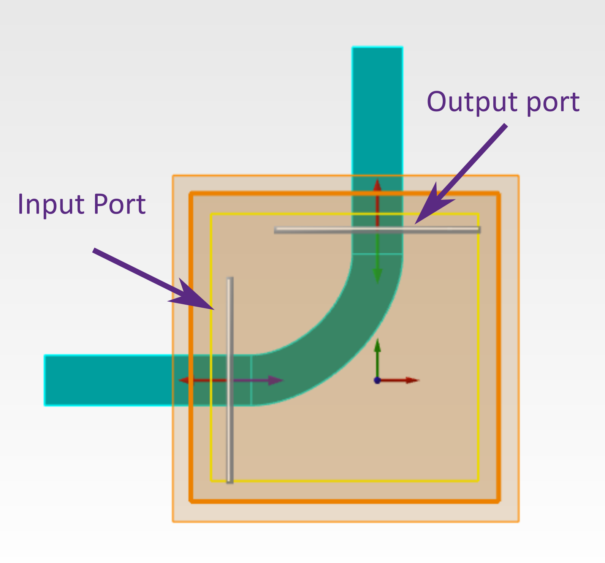
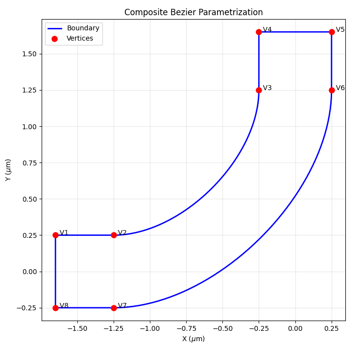
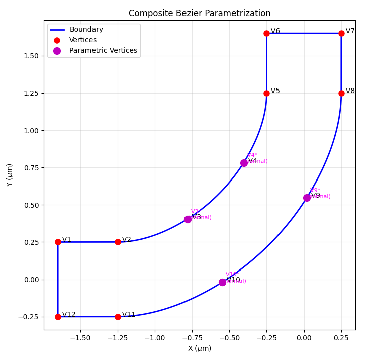
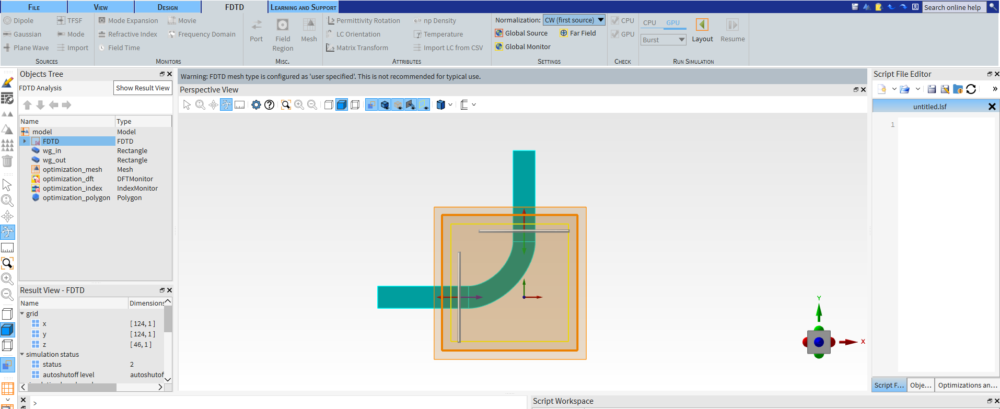
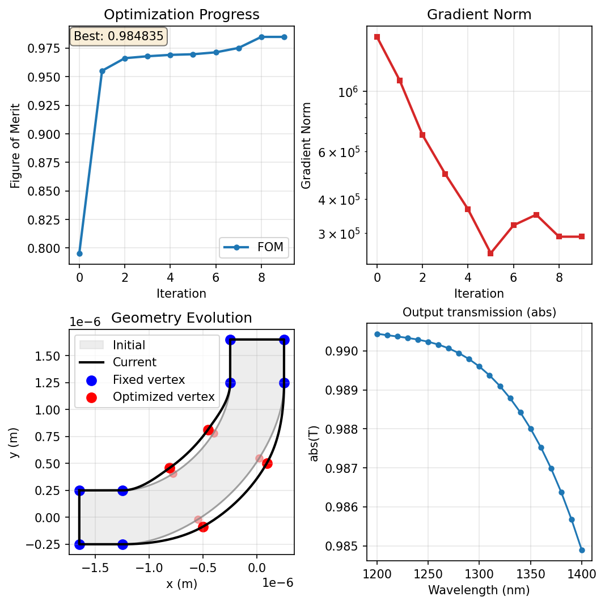

.. grid:: 1 1 1 1

    .. grid-item::

        .. button-link:: ../../_static/simulation_examples/lumopt2_lbend/L_bend.py
            :color: secondary
            :shadow:
            :align: center

            :octicon:`download` Download Python Script (.py)

Getting started with lumopt2: L-bend
=====================================

This example demonstrates using lumopt2 to optimize an L-bend waveguide coupler.

This example uses the closed curve parametrization approach, typically used for photonic integrated circuit applications, and demonstrates the use of a Python callable function for setup, and callbacks to customize the visualization.

For a more basic example demonstrating lumopt2 workflow, see the :doc:`simple metalens example <getting_started_simple_metalens>`.

The Python script associated with this example is attached to the article.

Base geometry
-------------

In this example, the base simulation is set up using a Python function, which defines the simulation region, optical ports, source settings, and monitor settings. This function is passed later to the project setup.
The function also sets up the geometry of the fixed input and output straight waveguides; however, the actual bend geometry to be optimized is defined by the :py:class:`~lumopt2.parametrization.closed_curve.ClosedCurve` class, as explained later.

.. code-block:: python
    :lineno-start: 35

    def generate_base_sim(fdtd):
        fdtd.addfdtd({"x min":fdtd_min_x-fdtd_buffer, "x max":fdtd_max_x+fdtd_buffer, "y min":fdtd_min_y-fdtd_buffer,
                    "y max":fdtd_max_y+fdtd_buffer, "z span":fdtd_span_z+2*fdtd_buffer, "index": n_bg,
                    "mesh accuracy": 3, "mesh refinement": "precise volume average"})

        # Input waveguides (horizontal - extending beyond crossing region)
        fdtd.addrect({"name": "wg_in",  "index": n_wg, "x min": 2*fdtd_min_x, "x max":-bend_start, "y":0, "y span":wg_width, "z span": wg_height})
        fdtd.addrect({"name": "wg_out", "index": n_wg, "y min": bend_start, "y max": 2*fdtd_max_y, "x":0, "x span":wg_width, "z span": wg_height})

        # Ports
        fdtd.addport({"name": "port_in"})
        fdtd.set("injection axis","x")
        fdtd.set({"x":-bend_start-dist_to_wall/2., "y":0, "y span":mode_width, "z span":mode_height, "direction":"Forward", "frequency dependent profile":False})

        fdtd.addport({"name": "port_out"})
        fdtd.set("injection axis","y")
        fdtd.set({"y": bend_start+dist_to_wall/2., "x":0, "x span":mode_width, "z span":mode_height, "direction":"Backward", "frequency dependent profile":False})

        # Source and monitor properties
        fdtd.setglobalsource("wavelength start", wavelengths[0])
        fdtd.setglobalsource("wavelength stop", wavelengths[-1])
        fdtd.setglobalmonitor("frequency points", len(wavelengths))
        fdtd.setglobalmonitor("use wavelength spacing", True)
        fdtd.setnamed("FDTD::ports","override global monitor settings",False)

For the L-bend geometry, first construct a closed path as a list of :py:class:`~lumopt2.parametrization.closed_curve.Segment` class instances.
Each :py:class:`~lumopt2.parametrization.closed_curve.Segment` object is described by the (x, y) coordinates of the start point and the type of segment (``linear`` for straight lines and ``cubic`` for a cubic polynomial).
The end point of each is segment is assumed to be the start point of the next; in the special case of the last segment in the list, the end point is the start of the first one.
The segments are connected ensuring both continuity of the curve and its first derivative to obtain a smooth 2D curve.

.. code-block:: python
    :lineno-start: 68

    path = [ (lmpt.Segment([ fdtd_min_x,              wg_width/2],             'linear')),  # Segment 1
         (lmpt.Segment([-wg_width/2-bend_radius,  wg_width/2],             'cubic')),   # Segment 2 (outer sidewall, parametric)
         (lmpt.Segment([-wg_width/2,              wg_width/2+bend_radius], 'linear')),  # Segment 3
         (lmpt.Segment([-wg_width/2,              fdtd_max_y],             'linear')),  # Segment 4
         (lmpt.Segment([ wg_width/2,              fdtd_max_y],             'linear')),  # Segment 5
         (lmpt.Segment([ wg_width/2,              wg_width/2+bend_radius], 'cubic')),   # Segment 6 (inner sidewall, parametric)
         (lmpt.Segment([-wg_width/2-bend_radius, -wg_width/2],             'linear')),  # Segment 7
         (lmpt.Segment([ fdtd_min_x,             -wg_width/2],             'linear')),  # Segment 8
       ]

After defining the path, pass it to the :py:class:`~lumopt2.parametrization.closed_curve.ClosedCurve` class to create the object, passing in along with other variables including the refractive index and thickness.
The optimization region must be passed to the :py:class:`~lumopt2.parametrization.closed_curve.ClosedCurve` class as well since it is an input for the ``Parametrization`` class later on.

.. code-block:: python
    :lineno-start: 81

    optimization_region = lmpt.Box(x_min=fdtd_min_x, x_max=fdtd_max_x,
                               y_min=fdtd_min_y, y_max=fdtd_max_y,
                               z_min=-wg_height/2.0, z_max=wg_height/2.0,
                               mesh_size=mesh_size)

    # Create base geometry using ClosedCurve
    closed_curve = lmpt.ClosedCurve(path, optimization_region=optimization_region, index=n_wg, z_min=-wg_height/2.0, z_max= wg_height/2.0)

At this point, the geometry is set up as a fixed L-bend, and you can visualize it using :py:class:`ClosedCurve.plot() <lumopt2.parametrization.closed_curve.ClosedCurve>` to ensure that the shape is as expected.

.. code-block:: python
    :lineno-start: 88

    closed_curve.plot() # Visualize the base geometry

Parametrization
---------------

For parametrization of the L-bend, you can use the :py:class:`~lumopt2.parametrization.closed_curve.Parametrize` class, which allows you to directly select the segment index to parametrize.

When creating this class, you specify a segment to parametrize, and a number of added vertices, which are allowed to move. In addition, you also specify the bounds and the direction of movement. Here the ``"normal"`` movement option restricts movement to the normal of the curve.

.. code-block:: python
    :lineno-start: 90

    ## CLOSED CURVE - PARAMETRIZATION ##
    num_pts_per_curve = 2                      # Number of control points to optimize for each of the two curved segments
    num_params        = 2 * num_pts_per_curve  # Total number of parameters

    # Each control point is allowed to slide along the local outward normal between
    # bounds[0] and bounds[1].  The asymmetric range gives the optimizer more room
    # to bow the silicon outward (positive direction) than to carve into it.
    bounds = (-200e-9, 400e-9)
    segments_to_parametrize = [lmpt.Parametrize(segment_index=2, num_added_vertices=num_pts_per_curve, bounds=bounds, movement='normal'),  # Outer sidewall
                               lmpt.Parametrize(segment_index=6, num_added_vertices=num_pts_per_curve, bounds=bounds, movement='normal')]  # Inner sidewall

After entering the settings, use the :py:class:`ClosedCurve.make_segments_parametric <lumopt2.parametrization.closed_curve.ClosedCurve>` to finalize the parametric segments.

.. code-block:: python
    :lineno-start: 99

    closed_curve.make_segments_parametric(segments_to_parametrize)

After parametrization, you can see the added vertices using :py:class:`ClosedCurve.plot() <lumopt2.parametrization.closed_curve.ClosedCurve>`.

.. code-block:: python
    :lineno-start: 101

    closed_curve.plot() # Visualize the base geometry

.. tip::

    In this example, the parametrization is set up such that each vertex can move independently of each other. You can also enforce symmetry by linking the movement of the vertices. For an example, please see the :doc:`parametrization page <parametrization>`.

Figure of merit
---------------

For this example, the figure of merit is set up using the :py:class:`~lumopt2.fom.simulation_results.PortResults` class, which takes in the name of a port object, metric, and target wavelengths.
In this example, we aim to maximize the transmission for the full O-band using a second order P-norm using :py:func:`~lumopt2.utils.common.PNorm`, with a target transmission of 1, which calculates the figure of merit based on :math:`1-\sqrt{\text{mean}((|T(\lambda)|-1)^2)}`.

.. code-block:: python
    :lineno-start: 109

    port_out = lmpt.PortResults('port_out', metric='transmission', wavelengths=wavelengths)
    l_bend_fom = lmpt.Fom(port_out, fct=lmpt.PNorm(p=2,target=1.0))

Project configuration
---------------------

The definition of the base geometry, parametrization, and figure of merit are passed to the :py:class:`lumopt2.core.project.Project`` class.
You can also include the :py:class:`lumopt2.core.fdtd_session.FdtdSession` and :py:class:`lumopt2.utils.runner.LocalRunner` classes if non-default settings needed. See the :doc:`simple metalens example <getting_started_simple_metalens>` for more details.

.. code-block:: python
    :lineno-start: 118

    project = lmpt.Project(setup=generate_base_sim, parametrization=closed_curve, fom=l_bend_fom, fdtd_session=fdtd_session)

At this point, you can open the project to ensure the set up is correct by calling :py:class:`Project.visualize_fom() <lumopt2.core.project.Project>`.
The initial figure of merit value is also printed in the terminal.

.. code-block:: python
    :lineno-start: 119

    project.visualize_fom()

Optimizer
---------

For this example, the optimization is ran with the :py:class:`~lumopt2.optimizer.scipy_optimizer.ScipyOptimizer` class with the default L-BFGS-B method and a maximum of 10 iterations.

.. code-block:: python
    :lineno-start: 123

    optimizer = lmpt.ScipyOptimizer(method='L-BFGS-B', max_iter=10)

Visualization and logging
-------------------------

To aid visualization and logging for this optimization, this example uses the built-in callback functions to plot the geometry, the figure of merit, the gradient norm, and a monitor result for each iteration of the optimization.

The visualizer is initialized using the :py:class:`~lumopt2.utils.graphical_visualizer.GraphicalVisualizer` class, with specific panels for each subplot.

.. code-block:: python
    :lineno-start: 128

    visualizer = lmpt.GraphicalVisualizer(
        figsize=(7, 7),
        layout=(2, 2),
        panels=[ lmpt.FomPanel(),
                lmpt.GradientNormPanel(),
                lmpt.GeometryPanel(),
                lmpt.MonitorPanel( monitor_name='FDTD::ports::port_out',
                                    result_name='T',
                                    operation='abs',
                            title='Output transmission',
            ),
        ],
    )

After specifying the visualizer, pass it as a callback function to the optimization object. In addition to the visualizer, a :py:class:`~lumopt2.utils.file_logger.FileLogger` is also included.

.. code-block:: python
    :lineno-start: 143

    optimization = lmpt.Optimization(
        project=project,
        optimizer=optimizer,
        callbacks=[visualizer, lmpt.FileLogger()],
    )

Results
--------

The simulation is run by calling the :py:class:`optimization.run() <lumopt2.core.optimization.Optimization>` method, with all previous settings combined into the ``Optimization`` project.

The final visualizer output is shown below.

After the simulation completes, export the final simulation file using the :py:class:`Project.save_project() <lumopt2.core.project.Project>` method.
In this example, the final project file is saved as ``L_bend_optimization_final.fsp`` in the optimization directory. This project file can then be used for further analysis or exporting for fabrication.

.. code-block:: python
    :lineno-start: 153

    best_params, best_fom = result
    project.save_project("L_bend_optimization_final.fsp",params=best_params)

.. tip::

    See the Lumerical Knowledge Base article `Importing and exporting GDSII files <https://optics.ansys.com/hc/en-us/articles/360034901933-Importing-and-exporting-GDSII-files>`_ for more information on exporting a GDS file from the final project.

Further resources
-----------------

After completing this example, further explore lumopt2 using the following pages.

.. grid:: 2 2 3 3

    .. grid-item-card:: lumopt2 user guide
        :link: ../photonic_inverse_design_with_lumopt2
        :link-type: doc

        Reference for key concepts in lumopt2 in further detail.

    .. grid-item-card:: lumopt2 API reference
        :link: ../../api/lumopt2/index
        :link-type: doc

        Full API reference for lumopt2, including all available classes and functions.

.. grid:: 1 1 1 1

    .. grid-item::

        .. button-link:: ../../_static/simulation_examples/lumopt2_lbend/L_bend.py
            :color: secondary
            :shadow:
            :align: center

            :octicon:`download` Download Python Script (.py)

..