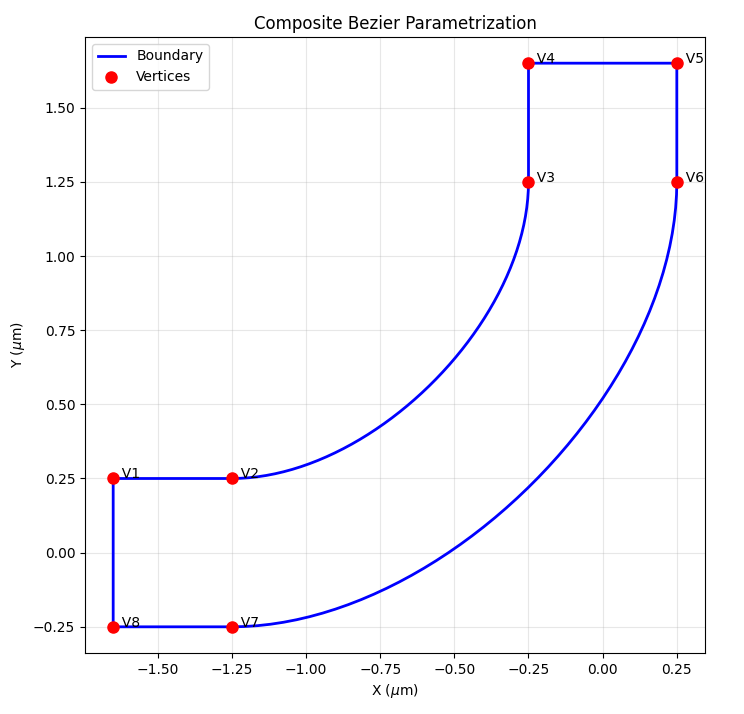
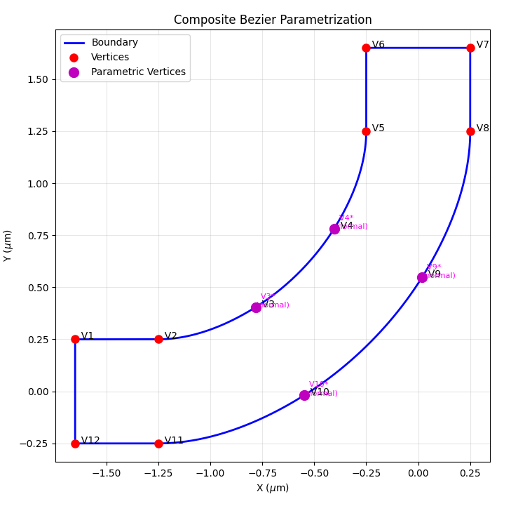
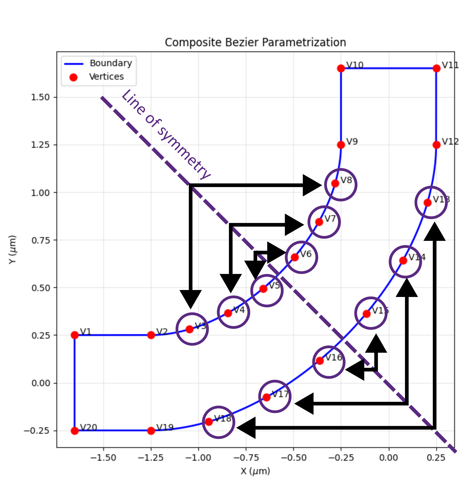

Parametrization
===============

Parametrization is the process of linking properties and geometry of the simulation to the optimization.

Two parametrization approaches are available in lumopt2:
- **Parametric optimization**: Maps arbitrary Lumerical object properties as optimization parameters.
- **Closed curve optimization**: Uses special classes to define an optimizable polygon.

In both cases, you must first define the optimization region. within which the parameters are adjusted.

Optimization region
--------------------

The optimization region defines the bounds within which the geometry of the simulations varied during optimization. You must ensure that all permutations of the geometry variation stays within the optimization region you define.

To define an optimization region, use the :py:class:`~lumopt2.utils.common.Box` class, which takes either the center and span, or min and max values in each dimension.
In definition, you can additionally specify the steps in each dimension using the ``dx, dy, dz`` arguments.
If you do not specify the steps, the optimization region is set up with a default step size of determined by the `mesh override simulation object <https://optics.ansys.com/hc/en-us/articles/360034901833-Mesh-override-Simulation-Object>`__.

.. code:: python

   # Define an optimization region centered at the origin with a span of 1 micron in each direction and a mesh size of 25 nm
   optimization_region = lmpt.Box(x_span = 1e-6, y_span = 1e-6, z_min = -1e-6, z_max = 1e-6,
                                 dx = 0.025e-6, dy = 0.025e-6, dz = 0.025e-6)

Parametric optimization
------------------------

The parametric optimization approach uses the :py:class:`lumopt2.parametrization.parametrization.Parametrization` class to link arbitrary Lumerical object properties as an optimization parameter.
This approach is the most general way to parametrize a design in lumopt2, and is suitable for a wide range of applications.

Defining parameter mapping
~~~~~~~~~~~~~~~~~~~~~~~~~~

To use the parametric optimization approach, you must define a function that takes a parameter vector as input, and outputs a dictionary where the keys are the names of Lumerical object properties, and the values are elements in the parameter vector.

For example, to define a parametrization that links the radius of different cylinders in the simulation, use the following code.

.. code:: python

   def my_parametrization(params):
    '''Map 3 parameters to cylinder radii'''
    return {
        "cyl0::radius": params[0],
        "cyl1::radius": params[1],
        "cyl2::radius": params[2]
    }

This effectively defines:

- :math:`p_0`: radius of cylinder 0
- :math:`p_1`: radius of cylinder 1
- :math:`p_2`: radius of cylinder 2

Here, the Lumerical object properties are specified in the format ``object_name::property_name``. Typically, you can find the property using the GUI, or by using the `getnamed <https://optics.ansys.com/hc/en-us/articles/360034408574-getnamed-Script-command>`_ command either through Lumerical scripting or Python by calling ``print(fdtd.getnamed("my_object_name"))``.

You can also define more complex parameter mapping, as any differentiable function of the parameter vector is supported.
For example, define a parameterization such that :math:`p_2` is the difference between the radius of cylinder 1 and cylinder 0, and :math:`p_3` is the difference between the radius of cylinder 2 and cylinder 1.

.. code:: python

   def my_parametrization(params):
    '''Map 3 parameters to cylinder radii'''
    return {
        "cyl0::radius": params[0],
        "cyl1::radius": params[0] + params[1],
        "cyl2::radius": params[0] + params[1] + params[2]
    }

You can also map parameters to a vector property of an object, such as the vertices of a polygon object. The autograd numpy library is used here to ensure that autograd can compute the jacobian of the parameter mapping function.

.. code:: python

   def polygon_parametrization(params):
       return {
           f"poly{idx}::vertices": anp.array([[0, value], [value, 0],
                                              [0, -value], [-value, 0]])
           for idx, value in enumerate(params)}

    }

Bounds and initial values
~~~~~~~~~~~~~~~~~~~~~~~~~

The parameter mapping function and the optimization region is passed along with the bounds for each parameter and an optional vector of initial values to the :py:class:`~lumopt2.parametrization.parametrization.Parametrization` class.

The bounds are passed as a list of tuples with the same length of the parameter vector, each element containing the lower and upper bound for each parameter. The initial values are passed as a list of values with the same length of the parameter vector.

The following example illustrates the definition of bounds and initial values for the 3-cylinder example above.

.. note::

   If the initial values are not provided, the optimization starts from the middle of the bounds by default.

.. code:: python

   parametrization = lmpt.Parametrization(
      func=mixed_parametrization,
      bounds=[(50e-9, 200e-9)] * 3,
      initial_params=[100e-9] * 3
   )

Functions not differentiable by autograd
~~~~~~~~~~~~~~~~~~~~~~~~~~~~~~~~~~~~~~~~

You can also define parameter mapping functions that autograd cannot track. In this case, you can set the ``use_jac`` property of the :py:class:`~lumopt2.parametrization.parametrization.Parametrization` object to False.
In this case, the class assumes that each optimization parameter affects all geometic objects in the optimization region, which may lead to less efficient gradient calculations.

.. code:: python

   def nondiff_func_parametrization(params):
    '''Map 5 parameters to cylinder radii using non-differentiable functions'''
    return {
        "cyl0::radius": nondiff_func1(params),
        "cyl1::radius": nondiff_func2(params),
        "cyl2::radius": nondiff_func3(params)
    }

   parametrization = lmpt.Parametrization(
      func=nondiff_func_parametrization,
      bounds=[(50e-9, 200e-9)] * 5,
      initial_params=[200e-9] * 5,
      use_jac=False
   )

Closed curve optimization
--------------------------

The closed curve optimization approach defines a closed bezier polygon using a series of paths, each of which can be linear or cubic.
This approach is generally useful for photonic integrated circuit applications, where the design is readily transformed into a polygon on a 2-D plane. As seen in the sections below, you can also enforce symmetry in the design by linking control points to each other.

Closed curve base object
~~~~~~~~~~~~~~~~~~~~~~~~
To set up a closed curve optimization, you must first define the base geometry object using :py:class:`~lumopt2.parametrization.closed_curve.ClosedCurve`.

The :py:class:`~lumopt2.parametrization.closed_curve.ClosedCurve` class ingests a tuple of control points, index, and thickness information to define a waveguide-like structure.
When you set up the base geometry object, specify only the control points necessary for the geometry. Additional control points for optimization are added later in the process.

To specify the control point, use a tuple of :py:class:`~lumopt2.parametrization.closed_curve.Segment`. Each element in the tuple corresponds to a control point in the curve, and definitions within the :py:class:`~lumopt2.parametrization.closed_curve.Segment` element specifies the location of the segment and how it connects to the next segment.

For example, the following code defines a simple L-bend within an FDTD simulation region, with a width of 500nm and bend radius of 1 micron.

.. code:: python

   bend_radius     = 1.0e-6
   bend_start      = wg_width/2+bend_radius
   dist_to_wall    = 0.4e-6                        # Distance from wall to start of the bend (lead waveguides)
   fdtd_min_x      =-(bend_start + dist_to_wall)
   fdtd_max_x      = 2*wg_width

   fdtd_min_y      =-2*wg_width
   fdtd_max_y      = bend_start + dist_to_wall

   path = [ (Segment([ fdtd_min_x,              wg_width/2],             'linear')),  # Segment 1 - linear
         (Segment([-wg_width/2-bend_radius,  wg_width/2],             'cubic')),   # Segment 2 - cubic
         (Segment([-wg_width/2,              wg_width/2+bend_radius], 'linear')),  # Segment 3 - linear
         (Segment([-wg_width/2,              fdtd_max_y],             'linear')),  # Segment 4 - linear
         (Segment([ wg_width/2,              fdtd_max_y],             'linear')),  # Segment 5 - linear
         (Segment([ wg_width/2,              wg_width/2+bend_radius], 'cubic')),   # Segment 6 - linear
         (Segment([-wg_width/2-bend_radius, -wg_width/2],             'linear')),  # Segment 7 - linear
         (Segment([ fdtd_min_x,             -wg_width/2],             'linear')),  # Segment 8 - cubic
       ]

After defining the segments, set up the closed curve object by passing in the tuple of segments along with the optimization region, the waveguide index and the thickness of the waveguide.

.. code:: python

   n_wg = 3.5 # Silicon waveguide
   wg_height = 0.22e-6 # 220nm height

   closed_curve = lmpt.ClosedCurve(path, optimization_region=optimization_region, index=n_wg, z_min=-wg_height/2.0, z_max= wg_height/2.0)

You can visualize the defined curve using :py:class:`ClosedCurve.plot() <lumopt2.parametrization.closed_curve.ClosedCurve>` function.

.. code:: python

   closed_curve.plot()

Parametrizing closed curves
~~~~~~~~~~~~~~~~~~~~~~~~~~~

To parametrize the closed curve, you can use the :py:class:`~lumopt2.parametrization.closed_curve.Parametrize` class, which adds additional control points along a segment so they can vary during optimization.
You specify a the start index of a segment based on the path you defined earlier for the base curve, the number control points, the bounds to apply to all new control points, and the degree of freedom for the new control points.

After defining the parametrization, finalize the parametrization using :py:class:`ClosedCurve.make_segments_parametric() <lumopt2.parametrization.closed_curve.ClosedCurve>`.

.. code:: python

   num_pts_per_curve = 2
   bounds = (-200e-9, 400e-9)
   segments_to_parametrize = [lmpt.Parametrize(segment_index=2, num_added_vertices=num_pts_per_curve, bounds=bounds, movement='normal'),  # Outer sidewall
                              lmpt.Parametrize(segment_index=6, num_added_vertices=num_pts_per_curve, bounds=bounds, movement='normal')]  # Inner sidewall
   closed_curve.make_segments_parametric(segments_to_parametrize)

.. note::

   In the example above, the ``movement`` argument is set to "normal", allowing the new control points to move normal to the curve. You can also set it to "x", "y", or "both" to specify the degree of freedom for the control points.

After defining the parametrized segments, you can also visualize the curve with the new control points using :py:class:`ClosedCurve.plot() <lumopt2.parametrization.closed_curve.ClosedCurve>` function.

.. code:: python

   closed_curve.plot()

Symmetric parametrization
~~~~~~~~~~~~~~~~~~~~~~~~~~

Sometimes, it is desirable to enforce symmetry in the design, such that certain control points move in relation to each other during optimization.

In this case, you must define a custom parametrization function that maps vertices to the same parameters using :py:class:`ClosedCurve.set_parametrization_function() <lumopt2.parametrization.closed_curve.ClosedCurve>`.

The custom parametrization function must directly act on a parameter array and link vertex numbers to the parameters, and return how each vertex of interest should move.
To achieve this, you can first manually split the segment into a desired number of control points using :py:class:`lumopt2.parametrization.closed_curve.EqualSplit`, and create vertex parameters using :py:class:`lumopt2.parametrization.closed_curve.ParamVertex`.

For example, the following code defines a custom parametrization function that enforces symmetry for the control points on the L-bend example above for a :math:`y=-x` symmetry, by effectively mapping the movement of specific control points to the same parameters.

.. code:: python

   num_pts_per_curve = 6                                  # Control vertices per curved segment
   num_free_per_curve = (num_pts_per_curve + 1) // 2      # Symmetry halves the DOF (rounded up so an odd middle vertex still counts once)
   num_params         = 2 * num_free_per_curve            # Two segments x free DOF per segment

   # Subdivide the segments

   split_result = closed_curve.split_segments([
    EqualSplit(segment_index=2, num_added_vertices=num_pts_per_curve),  # Outer sidewall
    EqualSplit(segment_index=6, num_added_vertices=num_pts_per_curve),  # Inner sidewall
    ])

   vertices_seg2 = split_result[2]
   vertices_seg6 = split_result[6]

   # Define custom parametrization function

   def symmetric_parametrization(params):
    """Build the per-vertex displacement list enforcing y = -x mirror symmetry.

    Parameters
    ----------
    params : array-like
        Length ``num_params`` array.  ``params[:num_free_per_curve]`` controls
        the outer sidewall (segment 2); ``params[num_free_per_curve:]`` controls
        the inner sidewall (segment 6).  Within each block, entry ``j`` drives
        the outward-normal displacement of the vertex at parametric position
        ``(j + 1) / (num_pts_per_curve + 1)`` along the segment, together with
        its mirror partner at position ``(num_pts_per_curve - j) / (num_pts_per_curve + 1)``.

    Returns
    -------
    list of ParamVertex
        Displacement specification for every control vertex on segments 2 and 6.
    """
    deltas = []
    # Segment 2: pair vertex i with vertex (num_pts_per_curve - 1 - i).
    for i, vtx_idx in enumerate(vertices_seg2):
        param_idx = min(i, num_pts_per_curve - 1 - i)
        deltas.append(ParamVertex(idx=vtx_idx, movement='normal', value=params[param_idx]))
    # Segment 6: same intra-segment pairing, with sign flipped so positive
    # parameter values bow the inner sidewall outward (same physical direction
    # as positive values on segment 2).
    for i, vtx_idx in enumerate(vertices_seg6):
        param_idx = num_free_per_curve + min(i, num_pts_per_curve - 1 - i)
        deltas.append(ParamVertex(idx=vtx_idx, movement='normal', value=-params[param_idx]))
    return deltas

   # Define bounds and set custom parametrization function

   bounds = (-200e-9, 400e-9)
   closed_curve.set_parametrization_function(
      func=symmetric_parametrization,
      n_params=num_params,
      bounds=bounds,
   )

The diagram below shows how the control points maps to each other in terms of movement.

